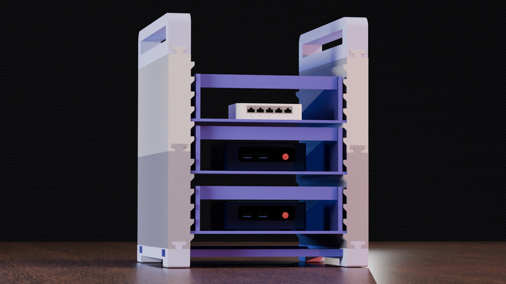
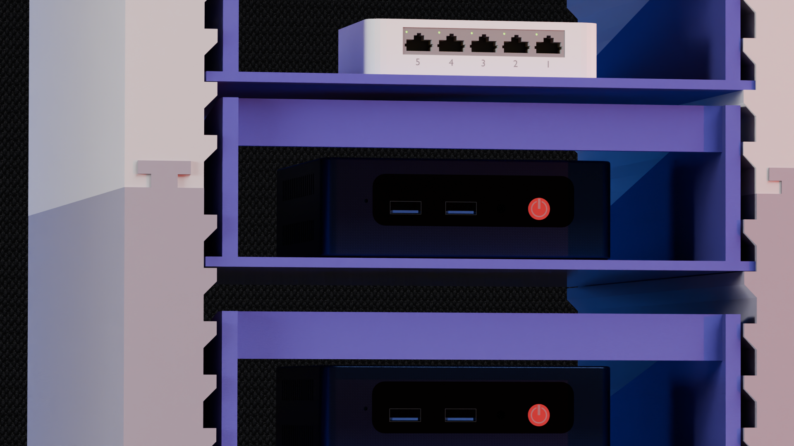
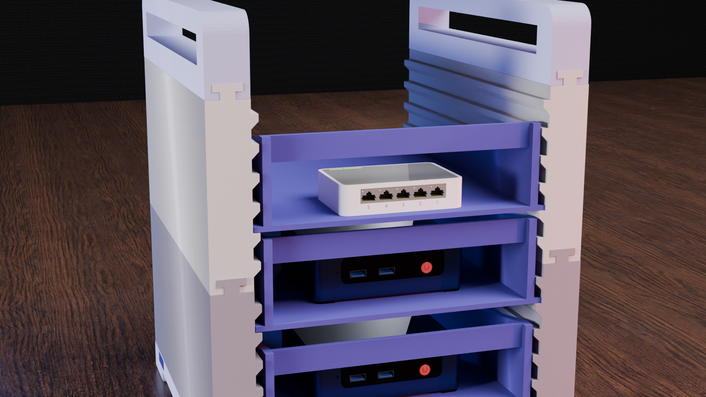
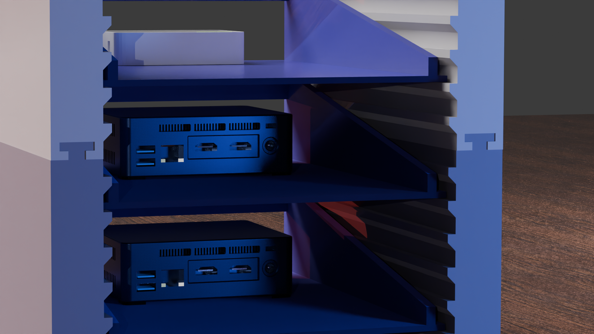
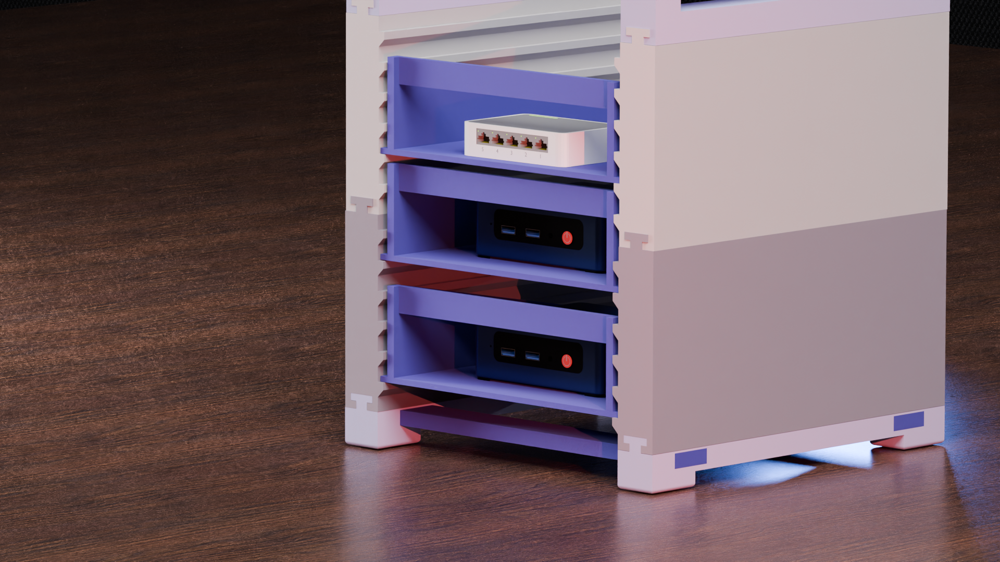
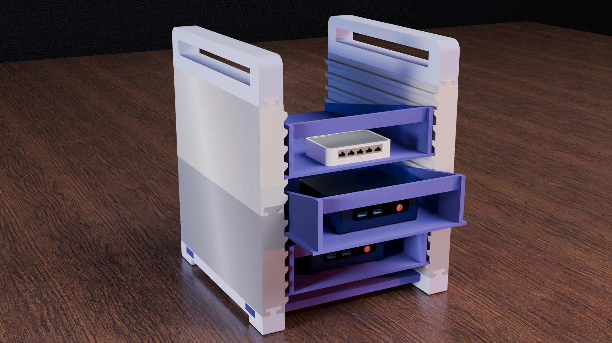

# 🏗️ Mini Stackable Rack

A **Mini Stackable Rack** is a fully 3D-printable, modular storage solution designed for easy assembly without the need for screws or additional hardware. Its unique sliding joints allow seamless stacking and customization. Whether for organizing tools, electronics, or any other small items, this rack is the perfect addition to your workspace! 🛠️

---

## 📌 Features
✔️ **Modular Design** – Stack as many units as needed to create custom storage solutions.  
✔️ **Tool-Free Assembly** – No screws, glue, or additional parts required.  
✔️ **Sliding Joints** – Pieces connect easily and securely through a custom sliding mechanism.  
✔️ **Separate Printable Parts** – Print only the pieces you need, making it ideal for small printers.  
✔️ **Sturdy and Compact** – Strong enough to hold tools, electronics, or small components.  
✔️ **Customizable** – Modify the design to fit your specific needs.

---

## 🖨️ Printing Instructions
### Recommended Print Settings:
- **Layer Height:** 0.2mm (or finer for better fitment)
- **Infill:** 20-30% (higher for extra strength)
- **Walls/Perimeters:** 3 or more
- **Supports:** Tree supports required for overhangs above 60°
- **Material:** PLA, PETG, or ABS (for extra durability)

### Assembly Instructions:
1. **Print each part separately** – drawers, frame, and mounting components.  
2. **Slide the pieces together** following the design's interlocking mechanism.  
3. **Stack as needed** to achieve your desired rack height.  
4. **Enjoy your fully modular storage system!** 🎉

---

## 📸 Showcase
Here are some high-quality renders of the **Mini Stackable Rack**:  

---

## 🛠️ Customization
Want to modify the rack to fit specific items? Here’s how:
- Adjust dimensions in your slicer for a custom fit.
- Remix the model in CAD software to add extra features.
- Change colors for a personalized look!

---

## 🏷️ License & Attribution
This project is licensed under the MIT License. Feel free to use, modify, and share it. If you remix or distribute it, please provide proper attribution to the original design. 🙌

📌 **Designed by:** Michel Lisboa
📧 **Contact:** michelMLG@outlook.com

---

## 🌟 Support the Project
If you enjoy this design, consider:
⭐ Giving it a like!  
💬 Sharing your prints and setups!  
🔄 Remixing and improving it!

Happy Printing! 🖨️🎉